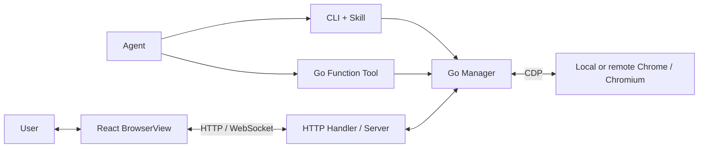

<div align="center">

# Awesome browserkit

**Local and remote browser control for agents, with embeddable live visualization.**

[](go.mod)
[](react/README.md)
[](LICENSE)

[简体中文](README.md) · **English**

[Capabilities](#capabilities) · [Integration](#integration) · [Local demo](#demo) · [React API](react/README.md)

</div>

Awesome browserkit exposes Chrome / Chromium page operations, live frame streaming, and diagnostics to agents and applications.
Agents use the CLI or Go functions to inspect pages, interact with elements, and manage tabs.
Users can watch execution, enter input, and take control through a React interface.
The browser can run locally, on a remote server, or as an existing browser with CDP debugging enabled.

<a id="capabilities"></a>

## Capabilities

| Capability | Details |
| --- | --- |
| **Attach to an existing browser** | Connect to an authorized Chrome / Chromium instance with its cookies, signed-in sessions, and page context. Attach to the active tab by default; disconnecting preserves the browser and its tabs. |
| **Isolated browser environments** | The CLI's `new` mode launches a headless browser with a temporary profile. Cookies and local storage are isolated from the everyday browser and other client processes. The profile is removed on exit. |
| **Agent page operations** | Snapshots provide page text, element references, and revision information. Click, hover, type, press keys, navigate, wait, capture screenshots, and manage tabs through functions that can be registered as tools in a host framework. |
| **Live frame streaming** | Browser frames travel over WebSocket and scale to the component container. Go quality presets configure frame rate and JPEG quality. Slow connections skip older frames to limit backlog. |
| **Remote visual interaction** | The React interface includes tabs, an address bar, mouse, touch, wheel, keyboard, and IME input. Input is executed on the browser host; resulting page changes return through the frame stream. |
| **Shared viewing and control** | Multiple clients can observe a session, with input coordinated through control ownership. Users can take control, while server-enforced read-only endpoints support observation of agent activity. |
| **Diagnostics** | Inspect console output, runtime exceptions, network requests, and page resources. The F12 panel provides filtering and details; agents can read records through diagnostic functions. |
| **Configurable UI** | Configure regions, buttons, input types, keyboard activation, and diagnostic panels per client. Customize appearance and dimensions with CSS variables, classes, and `style`. |

The diagnostic panel supports Console, Network, and Resources; it does not currently include Elements editing or JavaScript breakpoints.
Sessions are held in memory and are not restored after a service restart.

### Control and visualization



The CLI, Go functions, and HTTP handler use `Manager` to manage sessions and pages.
React displays browser frames and forwards input; page scripts and network requests execute in Chrome / Chromium.

<a id="integration"></a>

## Choose an integration

| Integration | Use case | Guide |
| --- | --- | --- |
| **Local Skill** | Let an agent use existing local sign-in state or browse in an isolated environment | [CLI and Skill](#local-skill) |
| **Standalone service** | Run browsers on a server and let clients view and interact remotely | [HTTP service](#http-service) |
| **Embedded library** | Add browser operations and visualization to an agent product, workbench, or application | [Go and React](#embedding) |

## Requirements and source

- Go 1.25.8+.
- Chrome / Chromium on the machine running the browser.
- Node.js 22+ to build the React component or demo. The component supports React 19.

```sh
git clone https://github.com/zeoxisca/awesome-browserkit.git
cd awesome-browserkit
go mod download
```

Run build commands from the repository root and dependency installation commands from the consuming application.

<a id="local-skill"></a>

## 1. CLI and Skill

The installer installs both the client and the Agent Skill:

```sh
./install.sh
export PATH="$HOME/.local/bin:$PATH"
browserkit --version
```

The default client directory is `~/.local/bin`.
The default Skill directory is `${CODEX_HOME:-~/.codex}/skills/browserkit-cli`.
Override them with `BROWSERKIT_BIN_DIR` and `BROWSERKIT_SKILL_DIR`.
Agent usage instructions are in the [Skill](skills/browserkit-cli/SKILL.md).

### Attach to an existing browser

Open `chrome://inspect/#remote-debugging` in Chrome and enable **Allow remote debugging for this browser**.
If that option is unavailable, upgrade Chrome.
Note the debugging address, return to the target tab, and accept Chrome's connection prompt when it appears.

```sh
browserkit --mode attach --remote 'http://127.0.0.1:9222'
```

Replace the example address with the actual CDP endpoint: HTTP `/json/version` or a browser WebSocket URL.
By default, the client attaches to the focused tab, falling back to the only visible tab when Chrome is unfocused.
If multiple windows make the target ambiguous, focus the target page and try again.
Exiting the client disconnects without closing the browser or its tabs.

### Launch an isolated browser

```sh
browserkit --url 'https://example.com'
```

The default `new` mode runs headless with a temporary profile.
Cookies and local storage are isolated from the everyday browser; exiting closes the browser and removes the profile.
Without `--url`, the agent creates a page through a tool call.

### `--url`

In every mode, `--url` creates a new tab in the selected browser and opens the address, even if a tab with the same URL already exists.
For example, open a new tab in an existing browser:

```sh
browserkit --mode attach --remote 'http://127.0.0.1:9222' --url 'https://example.com/workspace'
```

<a id="http-service"></a>

## 2. HTTP service

```sh
make server
./browserkit-server --addr 0.0.0.0:8787 \
  --url https://example.com \
  --allowed-origins https://app.example.com
```

The default listen address is `127.0.0.1:8787`.
Browser endpoints are under `/browser`; `/healthz` provides a health check.
Use `--remote` to connect to an existing browser. Without `--url`, the service waits for a client to create a page.
`--allowed-origins` accepts a comma-separated list of frontend origins.

[Install the React component](#react-install), then connect to the service:

```tsx
import { BrowserView } from '@browserkit/react'
import '@browserkit/react/style.css'

export function RemoteBrowser() {
  return <BrowserView
    endpoint="https://browser.example.com/browser"
    style={{ width: '100%', height: 640 }}
  />
}
```

<a id="embedding"></a>

## 3. Embed in an application

### Go

```sh
go get github.com/zeoxisca/awesome-browserkit
```

```go
import (
    "context"
    "net/http"

    browserkit "github.com/zeoxisca/awesome-browserkit"
    "github.com/zeoxisca/awesome-browserkit/browserhttp"
)

func mountBrowser(ctx context.Context, mux *http.ServeMux) (*browserkit.Manager, error) {
    manager, err := browserkit.NewManager(browserkit.Config{AllowDevtools: true})
    if err != nil { return nil, err }
    if _, err = manager.Open(ctx, browserkit.OpenRequest{URL: "https://example.com"}); err != nil {
        _ = manager.Close(context.Background())
        return nil, err
    }
    mux.Handle("/browser/", http.StripPrefix("/browser",
        browserhttp.NewHandler(manager, browserhttp.Options{})))
    return manager, nil
}
```

Call `manager.Close(context.Background())` when the application exits.
`Manager.Functions()` returns tools bound to that manager:

Pass each function’s `Name`, `Description`, and `Handler` to the host tool registry.
`Handler` has the signature `func(context.Context, Request) (Response, error)`.

Requests and responses are exported named structs.
The host provides schema validation and the tool invocation protocol.
See [examples/functions](examples/functions/main.go) for an adapter example.

### React

After [installing the component](#react-install):

```tsx
import { BrowserView } from '@browserkit/react'
import '@browserkit/react/style.css'

export function BrowserPanel() {
  return <BrowserView endpoint="/browser" style={{ height: 560 }} />
}
```

See the [React API](react/README.md) for UI, input, and diagnostic options.
The detailed API and Skill documentation are currently in Chinese.

<a id="react-install"></a>

## Install the React component

The component is not yet published to npm. Build a package in the Awesome browserkit repository:

```sh
npm ci --prefix react
make pack
```

Install it in the React application, replacing the package path:

```sh
npm install /path/to/awesome-browserkit/react/browserkit-react-0.1.0.tgz
```

If the application does not already use React 19:

```sh
npm install react@^19 react-dom@^19
```

<a id="demo"></a>

## Run the demo locally

Install Go 1.25.8+, Node.js 22+, and Chrome / Chromium, then run:

```sh
git clone https://github.com/zeoxisca/awesome-browserkit.git
cd awesome-browserkit
make install
make build
make demo
```

If you already have the source, run the last three commands from the repository root.
`make demo` starts the Go service and browser with a bundled example page.
Open the [workbench](http://127.0.0.1:8877/) or [quick start](http://127.0.0.1:8877/#/quickstart).
Press Ctrl+C to stop the service and browser.

To use another port or Chrome executable:

```sh
go run ./examples/demo --addr 127.0.0.1:8878 --chrome /path/to/chrome
```

See [Contributing](CONTRIBUTING.md) for development and test commands.

## License

[Apache-2.0](LICENSE).
