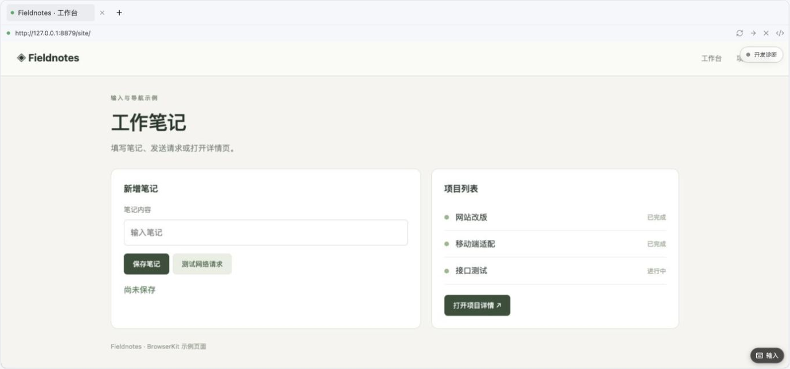
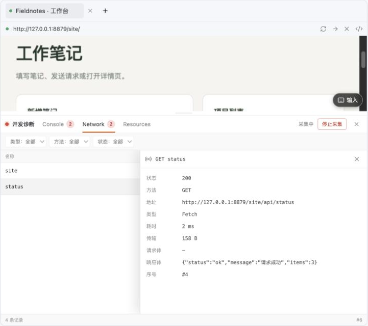
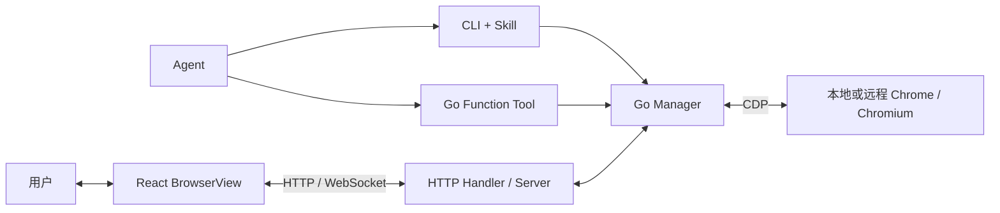

<div align="center">

# Awesome browserkit

**为 Agent 提供本地与远程浏览器操作，以及可嵌入的实时可视化界面。**

[](go.mod)
[](react/README.md)
[](LICENSE)

**简体中文** · [English](README.en.md)

[核心能力](#capabilities) · [接入方式](#integration) · [本地 Demo](#demo) · [React API](react/README.md)

</div>

Awesome browserkit 将 Chrome / Chromium 的页面操作、实时图流和开发诊断提供给 Agent 与应用。
Agent 可通过 CLI 或 Go 函数读取页面、操作元素和管理 Tab；用户可通过 React 界面观看执行过程、输入内容并接管操作。
浏览器可以运行在本机或远程服务器上，也可以连接已启用 CDP 调试的浏览器。

## 界面预览



<details>
<summary>查看 F12 诊断面板</summary>



</details>

<a id="capabilities"></a>

## 核心能力

| 能力 | 说明 |
| --- | --- |
| **已有环境接管** | 连接已授权的 Chrome / Chromium，使用现有 Cookie、登录态和页面上下文。默认绑定激活 Tab，断开连接后保留浏览器与页面。 |
| **独立浏览器环境** | CLI 的 `new` 模式创建临时 profile，在无头浏览器中执行任务。Cookie 和本地存储与日常浏览器及其他 client 进程隔离，退出时清理。 |
| **面向 Agent 的页面操作** | 页面快照提供文本、元素引用和版本信息。支持点击、悬停、文本输入、按键、导航、等待、截图与 Tab 管理，可封装为宿主框架的 Function Tool。 |
| **实时图流** | 通过 WebSocket 传输浏览器渲染帧，按容器尺寸显示。Go 端可配置帧率与 JPEG 质量档位，慢连接跳过旧帧，减少画面积压。 |
| **远程可视化操作** | React 界面提供 Tab 栏、地址栏、鼠标、触摸、滚轮、键盘和中文输入法。操作发往浏览器所在机器，页面变化通过图流回传。 |
| **协作与观察** | 多个客户端可观看同一会话，通过操作权协调输入。支持用户接管与服务端只读观察入口，适合展示 Agent 执行过程。 |
| **开发诊断** | 收集 Console、运行时异常、Network 请求和页面资源。F12 面板支持筛选与详情查看，Agent 可通过诊断函数读取记录。 |
| **组件定制** | 按客户端配置区域、按钮、输入类型、键盘唤起方式和诊断面板。通过 CSS 变量、class 与 `style` 调整外观和尺寸。 |

诊断面板提供 Console、Network 和 Resources，暂不支持 Elements 编辑或 JavaScript 断点调试。
会话状态保存在进程内，服务重启后不自动恢复。

### 控制与可视化链路



CLI、Go 函数和 HTTP Handler 使用 `Manager` 管理会话与页面。
React 显示浏览器画面并传递输入；网页脚本和网络请求在 Chrome / Chromium 中执行。

<a id="integration"></a>

## 选择接入方式

| 使用方式 | 适合场景 | 入口 |
| --- | --- | --- |
| **本地 Skill** | Agent 使用本机已有登录态，或在独立环境中完成浏览任务 | [CLI 与 Skill](#local-skill) |
| **独立服务** | 浏览器集中运行在服务器上，客户端远程观看和操作 | [HTTP 服务](#http-service) |
| **嵌入应用** | 为 Agent 产品、工作台或业务应用增加浏览器操作与可视化 | [Go 与 React](#embedding) |

## 环境与源码

- Go 1.25.8+。
- Chrome / Chromium：安装在运行浏览器的机器上。
- Node.js 22+：构建 React 组件或 demo 时需要。组件支持 React 19。

```sh
git clone https://github.com/zeoxisca/awesome-browserkit.git
cd awesome-browserkit
go mod download
```

以下构建命令在仓库根目录执行，依赖安装命令在使用该依赖的应用目录执行。

<a id="local-skill"></a>

## 1. CLI 与 Skill

安装脚本同时安装 client 和 Agent Skill：

```sh
./install.sh
export PATH="$HOME/.local/bin:$PATH"
browserkit --version
```

默认 client 目录为 `~/.local/bin`，Skill 目录为 `${CODEX_HOME:-~/.codex}/skills/browserkit-cli`。
用 `BROWSERKIT_BIN_DIR` 和 `BROWSERKIT_SKILL_DIR` 修改安装位置。
Agent 操作约定见 [Skill](skills/browserkit-cli/SKILL.md)。

### 接管已有浏览器

在 Chrome 打开 `chrome://inspect/#remote-debugging`，启用「允许调试本浏览器」。
若当前版本没有此选项，需要升级 Chrome。
记录调试地址，切回目标 Tab；连接时在 Chrome 中确认授权提示。

```sh
browserkit --mode attach --remote 'http://127.0.0.1:9222'
```

将示例地址替换为实际 CDP 入口，支持 HTTP `/json/version` 或 browser WebSocket。
默认接管激活 Tab；Chrome 失焦时选择唯一可见 Tab。
多个窗口导致目标不明确时，切回目标页并保持浏览器焦点后重试。
退出 client 会断开连接，保留浏览器和 Tab。

### 启动独立浏览器

```sh
browserkit --url 'https://example.com'
```

默认 `new` 模式使用临时 profile，以无头模式运行。
Cookie 和本地存储与日常浏览器隔离；退出时关闭浏览器并删除临时 profile。
不传 `--url` 时，由 Agent 创建页面。

### `--url`

所有模式下，`--url` 都在所使用的浏览器中新建 Tab 并打开地址，包括已有同地址 Tab 的情况。
例如，在已连接的浏览器中打开新 Tab：

```sh
browserkit --mode attach --remote 'http://127.0.0.1:9222' --url 'https://example.com/workspace'
```

<a id="http-service"></a>

## 2. HTTP 服务

```sh
make server
./browserkit-server --addr 0.0.0.0:8787 \
  --url https://example.com \
  --allowed-origins https://app.example.com
```

默认监听 `127.0.0.1:8787`，浏览器入口为 `/browser`，健康检查为 `/healthz`。
`--remote` 可指定已有浏览器；省略 `--url` 时等待客户端创建页面。
`--allowed-origins` 接受逗号分隔的前端 Origin。

按下方[组件安装](#react-install)生成并安装 React 包，然后连接服务：

```tsx
import { BrowserView } from '@browserkit/react'
import '@browserkit/react/style.css'

export function RemoteBrowser() {
  return <BrowserView
    endpoint="https://browser.example.com/browser"
    style={{ width: '100%', height: 640 }}
  />
}
```

<a id="embedding"></a>

## 3. 嵌入应用

### Go

```sh
go get github.com/zeoxisca/awesome-browserkit
```

```go
import (
    "context"
    "net/http"

    browserkit "github.com/zeoxisca/awesome-browserkit"
    "github.com/zeoxisca/awesome-browserkit/browserhttp"
)

func mountBrowser(ctx context.Context, mux *http.ServeMux) (*browserkit.Manager, error) {
    manager, err := browserkit.NewManager(browserkit.Config{AllowDevtools: true})
    if err != nil { return nil, err }
    if _, err = manager.Open(ctx, browserkit.OpenRequest{URL: "https://example.com"}); err != nil {
        _ = manager.Close(context.Background())
        return nil, err
    }
    mux.Handle("/browser/", http.StripPrefix("/browser",
        browserhttp.NewHandler(manager, browserhttp.Options{})))
    return manager, nil
}
```

应用退出时调用 `manager.Close(context.Background())`。
`Manager.Functions()` 返回绑定该 Manager 的工具函数：

将函数的 `Name`、`Description` 和 `Handler` 交给宿主工具注册器。
`Handler` 的签名为 `func(context.Context, Request) (Response, error)`。

请求和响应使用导出的命名结构体，宿主负责 Schema 校验和工具调用协议。
适配示例见 [examples/functions](examples/functions/main.go)。

### React

完成[组件安装](#react-install)后，在应用中使用：

```tsx
import { BrowserView } from '@browserkit/react'
import '@browserkit/react/style.css'

export function BrowserPanel() {
  return <BrowserView endpoint="/browser" style={{ height: 560 }} />
}
```

组件区域、输入和诊断配置见 [React API](react/README.md)。

<a id="react-install"></a>

## React 组件安装

组件尚未发布到 npm。先在 Awesome browserkit 仓库生成安装包：

```sh
npm ci --prefix react
make pack
```

在 React 项目中安装，替换安装包路径：

```sh
npm install /path/to/awesome-browserkit/react/browserkit-react-0.1.0.tgz
```

项目尚未安装 React 19 时执行：

```sh
npm install react@^19 react-dom@^19
```

<a id="demo"></a>

## 本地启动 Demo

本机安装 Go 1.25.8+、Node.js 22+ 和 Chrome / Chromium 后：

```sh
git clone https://github.com/zeoxisca/awesome-browserkit.git
cd awesome-browserkit
make install
make build
make demo
```

已有源码时，从仓库目录运行最后三条命令。
`make demo` 启动 Go 服务和浏览器，默认打开内置示例网页。
访问 [工作台](http://127.0.0.1:8877/) 或 [快速开始](http://127.0.0.1:8877/#/quickstart)。
按 Ctrl+C 停止服务和浏览器。

修改端口或指定 Chrome 路径：

```sh
go run ./examples/demo --addr 127.0.0.1:8878 --chrome /path/to/chrome
```

测试与开发命令见 [贡献指南](CONTRIBUTING.md)。

## 许可证

[Apache-2.0](LICENSE)。
